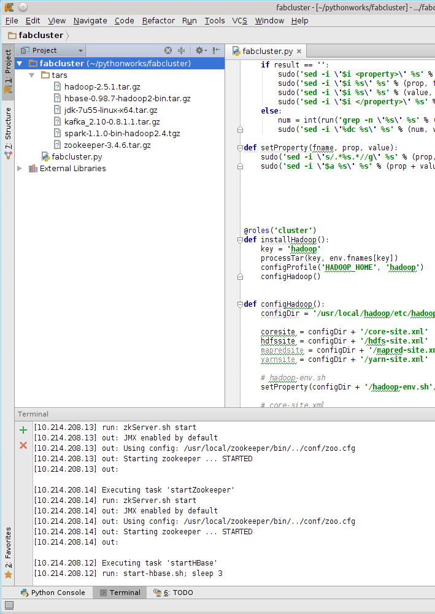

fabcluster is a python program for spark (including hadoop, hbase, kafka, zookeeper) cluster deploying and basic management.   

It uses fabric package as the deploy and manage tool. You can use it to setup basic configuration in a cluster, including hosts, disable firewall, create a new user and set all the following deploying and management under the new-user-role's control.

Before you start reading and using my program, I advice you reading some tutorials about python and fabric. ( Before I wrote this program, actually I know nothing about python and fabric. = =| )

So here is two tutorials I think which are helpful for you to understand my program. I ever wrote some samples for my studying and tried some easy commands in python console, so I just suggest you writing something when you are learning.

Liao Xuefeng's tutorial (Chinese~~) : [http://www.liaoxuefeng.com/wiki](http://www.liaoxuefeng.com/wiki/001374738125095c955c1e6d8bb493182103fac9270762a000)

Fabric Tutorial : [http://docs.fabfile.org](http://docs.fabfile.org)

Preparation:

1. Set up your your nodes ip in clusters.   

        clusters = ['10.214.208.11', '10.214.208.12', '10.214.208.13', '10.214.208.14']

2. Set your common user name and password (which user should have the sudo right)   

        env.user = 'king'       
        env.password = 'your password'

3. the env.keywords coordinates the files in tars, finally the structure should like following pic. You can remove or add your own keywords and implements the installation by yourself. It is not difficult because I have hoed out most bash shell problems in my code.

        env.keywords = ['jdk', 'hadoop', 'zookeeper', 'hbase', 'kafka', 'spark']
        # get all the tars name under the directory './tars'
        env.fnames = dict(zip(sorted(env.keywords), sorted(os.listdir('./tars'))))

    

4. One of the most important thing is to set up your sub-clusters of each role in env.roledefs. You can change some settings here.

        env.roledefs = {
            'cluster': clusters,
            'hadoop_master': clusters[:1],
            'hadoop_smaster': clusters[1:2],
            'hadoop_slaves': clusters,
            'zookeeper': clusters[1:],
            'hbase': clusters,
            'hbase_master': clusters[1:2],
            'hbase_slaves': clusters,
            'kafka': clusters[2:],
            'spark': clusters,
            'spark_master': clusters[2:3],
            'spark_slaves': clusters
        }

5. Set your new user's name, group, password. I believe it is reasonable to use one user for the cluster's every working module. 

        newgroup = 'hadoop'
        newuser = 'hadoop'
        newpasswd = 'hadoop'

---

Then I record some words about the usage of my program. It is very easy if you understand the fabric principles.

        fab -f fabcluster.py installs

The command upside will run the whole installation. It starts from basic settings, including hosts, new user, ssh no passwords, disable Firewall, set NTP. Then completes JDK installation, Hadoop, Zookeeper, HBase, Kafka, Spark.  

        fab -f fabcluster.py installs:hbase

It will install HBase, including all basic installations, and Hadoop, Zookeeper. Because HBase is running on HDFS and Zookeeper.

        fab -f fabcluster.py installs:kafka
        fab -f fabcluster.py installs:spark

This two just install singular kafka and spark.

And I set up some interfaces about starts, stops and cleans work.

        fab -f fabcluster.py starts
        fab -f fabcluster.py starts:hadoop
        fab -f fabcluster.py starts:hbase
        
        fab -f fabcluster.py stops
        
        fab -f fabcluster.py cleans

In fact, I think you will write your own deploy program. May my program helps.

Thank you.
